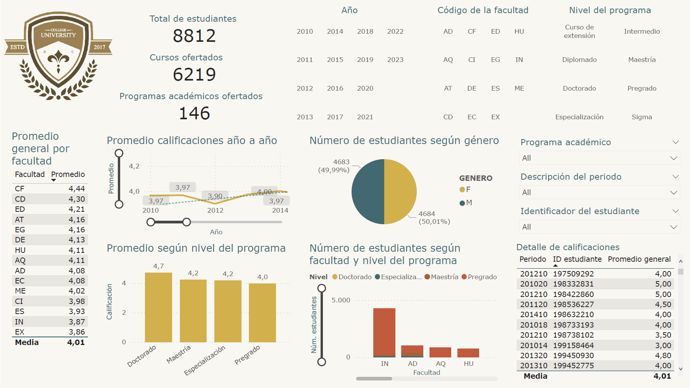

# University-grades-tracking-BI

This is a proof-of-concept for a Power BI report that allows an University to track student grades across faculties, programs, courses and academic periods (date). For a better preview, you can [download the PDF file](./University_grades_tracking_BI.pdf).

The dataset in this project is confidential and for demonstration purposes only. Please refer to the [license](./LICENSE) for more details.

To interact with this report, you must install Power BI Desktop. Download both the [PBIX file](./University_grades_tracking_BI.pbix) and the [Excel dataset](./BaseNotasCursos.xlsx), and upon opening the report use the "Data source settings" within the "Transform data" options of the "Queries" menu to reconfigure the file route to the Excel dataset.
